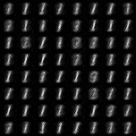
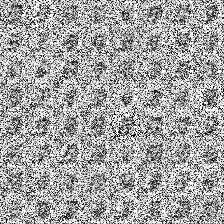

# Compressive Sensing

A close reference: 

Wu, Yan, Mihaela Rosca, and Timothy Lillicrap. "Deep compressed sensing." International Conference on Machine Learning. PMLR, 2019.

**The meansurement matrix F is reparameterized as a deep neural network.**

## Reconstruction Error $\lVert x-\hat{x}\rVert_2$ for MNIST
- Ours: 4.78
- DCS: 3.4

## Reconstruction on MNIST test dataset (Formula (7) is trained as a deep neural network)

|Method|RECON_LOSS|Origin image| 1 steps|3 steps | 5 steps|
|-------| ----|------- | -----|------ |-----|
|grad+ $F_\phi$ (L)|4.78|||||
|NN + $F_\phi$ (L)|10.20|||||
|grad + Linear $F$ (L)|13.44|||||
|grad + Linear $F$|37.46|||||

## Reconstruction with LASSO on MNIST test dataset
$$minimize \frac{1}{2M} \lVert y-Ax \rVert_2^2 + \alpha \lVert x\rVert_1, A \in R^{M \times N}, y \in R^M, x \in R^N$$

### M=100
|N=28 $\times$ 28 = 784|Original|$iters$ = 500|$iters$ = 1000|$iters$ = 2000|
|-------| ----|------- | -----|---|
|$\alpha=0.01$|||||
|$\alpha=0.001$|||||

### M=200
|N=28 $\times$ 28 = 784|Original|$iters$ = 500|$iters$ = 1000|$iters$ = 2000|
|-------| ----|------- | -----|---|
|$\alpha=0.01$|||||
|$\alpha=0.001$|||||

### M=300
|N=28 $\times$ 28 = 784|Original|$iters$ = 500|$iters$ = 1000|$iters$ = 2000|
|-------| ----|------- | -----|---|
|$\alpha=0.01$|||||
|$\alpha=0.001$|||||
## Training Curve

