# Compressive Sensing using Generative Models

Reference: 
 [1] Wu, Yan, Mihaela Rosca, and Timothy Lillicrap. "Deep compressed sensing." International Conference on Machine Learning. PMLR, 2019.
 
 Linear measurment process: $\textbf{y} = \\textbf{F} \\textbf{x}$, where the true signal $\\textbf{x} \in \mathbb{R}^n$, $\textbf{F} \in \mathbb{R}^{m \times n}$, and $\textbf{y} \in \mathbb{R}^m $, $m \ll n$.

## Reconstruction Error $\lVert x-\hat{x}\rVert_2$ for MNIST

A pretrained model $G_\theta$: $G$ is a neural network with parameter $\theta$.

- Ours: 4.78
- DCS: 3.4

## Reconstruction on the MNIST dataset (Formula (7) is trained as a deep neural network)

 $\textbf{F}_\phi$: $\textbf{F}$ is reparameterized as a deep neural network with parameter $\phi$.

|Method|RECON_LOSS|Origin image| 1 steps|3 steps | 5 steps|
|-------| ----|------- | -----|------ |-----|
|$\textbf{F}_\phi$ (L) + grad|4.78|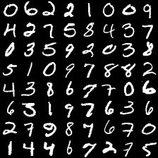|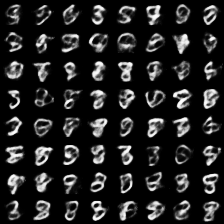|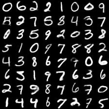|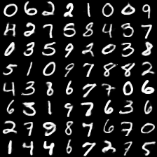|
|$\textbf{F}_\phi$ (L) + NN|10.20||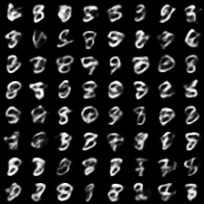||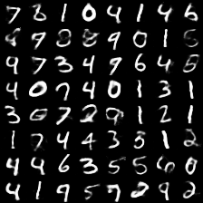|
|Fix $\textbf{F}$ + grad steps          m =100 |6.97||||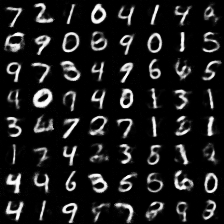|
|Fix $\textbf{F}$ + grad steps          m=300|4.50||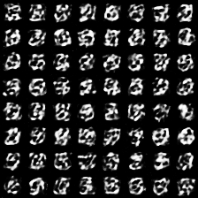|||

<!-- ## Reconstruction with LASSO on MNIST test dataset
$$\min_x \frac{1}{2M} \lVert y-Ax \rVert_2^2 + \alpha \lVert x\rVert_1, A \in R^{M \times N}, y \in R^M, x \in R^N$$

### M=100
|N=28 $\times$ 28 = 784|Original|$iters$ = 500|$iters$ = 1000|$iters$ = 2000|
|-------| ----|------- | -----|---|
|$\alpha=0.01$||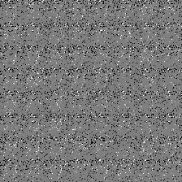|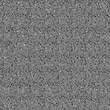|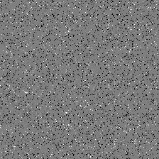|
|$\alpha=0.001$||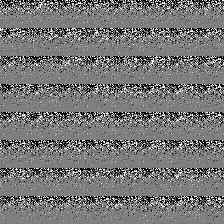|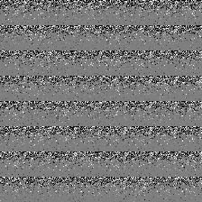|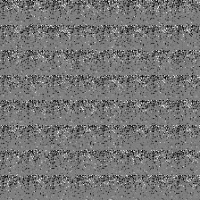|

### M=200
|N=28 $\times$ 28 = 784|Original|$iters$ = 500|$iters$ = 1000|$iters$ = 2000|
|-------| ----|------- | -----|---|
|$\alpha=0.01$|||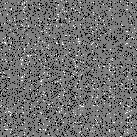||
|$\alpha=0.001$||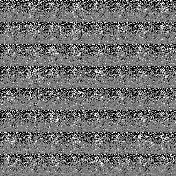|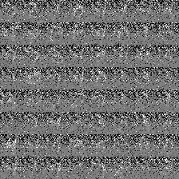|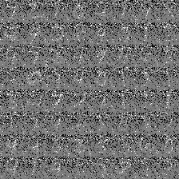|

### M=300
|N=28 $\times$ 28 = 784|Original|$iters$ = 500|$iters$ = 1000|$iters$ = 2000|
|-------| ----|------- | -----|---|
|$\alpha=0.01$||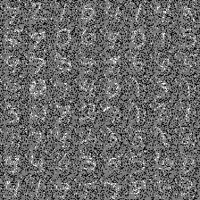|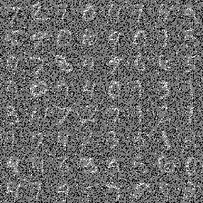|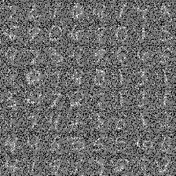|
|$\alpha=0.001$||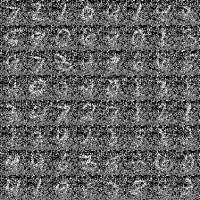|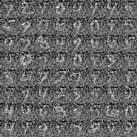|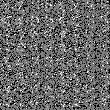|


## Reconstruction with SLEP on the MNIST dataset
- Installation Link: http://www.yelabs.net/software/SLEP/
- Run the following command to use SLEP:
```
mexC;
addpath(genpath([root ’/SLEP’]));
```

### LogisticR
- [x, c, funVal]=LogisticR(A, y, λ, opts)
$$\min_x \sum_{i=1}^M \omega_i \log (1+exp(-y_i(x^T a_i+c)))+\frac{\rho}{2}\lVert x\rVert_2^2 + \alpha \lVert x\rVert_1, A \in R^{M \times N}, y \in R^M, x \in R^N$$

#### M=100
|N=28 $\times$ 28 = 784|Original|$iters$ = 500|$iters$ = 1000|$iters$ = 2000|
|-------| ----|------- | -----|---|
|$\alpha=0.01$||||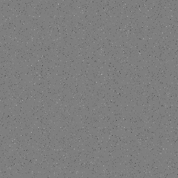|
|$\alpha=0.001$|||||

#### M=200
|N=28 $\times$ 28 = 784|Original|$iters$ = 500|$iters$ = 1000|$iters$ = 2000|
|-------| ----|------- | -----|---|
|$\alpha=0.01$||||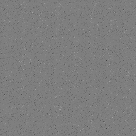|
|$\alpha=0.001$|||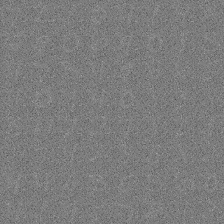||
#### M=300
|N=28 $\times$ 28 = 784|Original|$iters$ = 500|$iters$ = 1000|$iters$ = 2000|
|-------| ----|------- | -----|---|
|$\alpha=0.01$|||||
|$\alpha=0.001$||||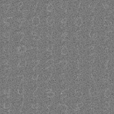|


### LeastR
- [x, funVal]=LeastR(A, y, λ, opts)
$$\min_x \frac{1}{2} \lVert Ax -y \rVert_2^2 + \frac{\rho}{2}\lVert x\rVert_2^2 + \alpha \lVert x\rVert_1, A \in R^{M \times N}, y \in R^M, x \in R^N$$

#### M=100
|N=28 $\times$ 28 = 784|Original|$iters$ = 500|$iters$ = 1000|$iters$ = 2000|
|-------| ----|------- | -----|---|
|$\alpha=0.01$||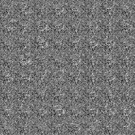|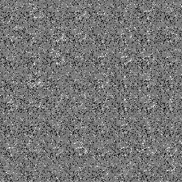|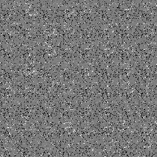|
|$\alpha=0.001$||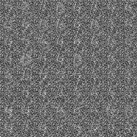|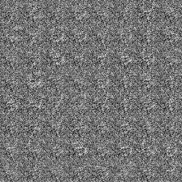||

#### M=200
|N=28 $\times$ 28 = 784|Original|$iters$ = 500|$iters$ = 1000|$iters$ = 2000|
|-------| ----|------- | -----|---|
|$\alpha=0.01$||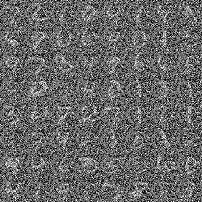||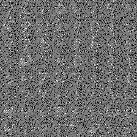|
|$\alpha=0.001$||||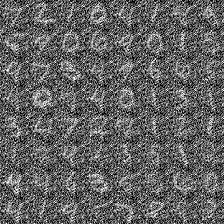|
#### M=300
|N=28 $\times$ 28 = 784|Original|$iters$ = 500|$iters$ = 1000|$iters$ = 2000|
|-------| ----|------- | -----|---|
|$\alpha=0.01$|||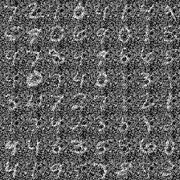|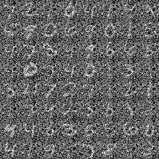|
|$\alpha=0.001$|||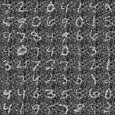||

### LeastR with DCT
- [x, funVal]=LeastR(A, y, λ, opts)
$$\min_x \frac{1}{2} \lVert Ax -y \rVert_2^2 + \frac{\rho}{2}\lVert x\rVert_2^2 + \alpha \lVert x\rVert_1, A \in R^{M \times N}, y \in R^M, x \in R^N$$

#### M=100
|N=28 $\times$ 28 = 784|Original|$iters$ = 500|$iters$ = 1000|$iters$ = 2000|
|-------| ----|------- | -----|---|
|$\alpha=0.01$|||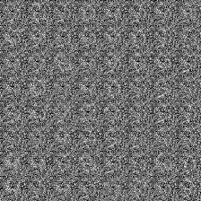||
|$\alpha=0.001$||||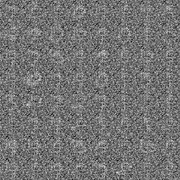|

#### M=200
|N=28 $\times$ 28 = 784|Original|$iters$ = 500|$iters$ = 1000|$iters$ = 2000|
|-------| ----|------- | -----|---|
|$\alpha=0.01$||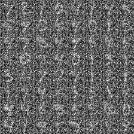||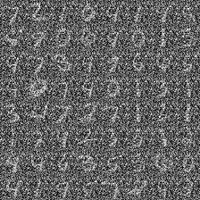|
|$\alpha=0.001$|||||
#### M=300
|N=28 $\times$ 28 = 784|Original|$iters$ = 500|$iters$ = 1000|$iters$ = 2000|
|-------| ----|------- | -----|---|
|$\alpha=0.01$|||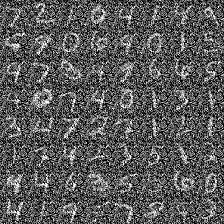||
|$\alpha=0.001$|||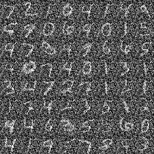|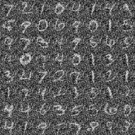|

## SLEP LASSO on synthetic data
### Experiment Settings
| N | Sparsity | $\lambda$ | convergence $\epsilon$ | maxIter |
|---|----------|-----------|------------|---------|
|100|  0.05    |     0.001 | 1e-6       |  5000       | 

### LeastR
| M | numIter | $\lVert X_{origin} - \Phi\theta\rVert_2$ |  $\lVert \Phi\theta\rVert_2$|$\lVert X_{origin}\rVert_2$ |
|---|----------|-----------|------------|---------|
|30|  154   |     1.056 | 0.656       |  1.242       |
|60|  336    |     0.782 | 0.970      |  1.242       | 
|90|  628    |     0.365 | 1.179       |  1.242       | 

## Training Curve
 -->
