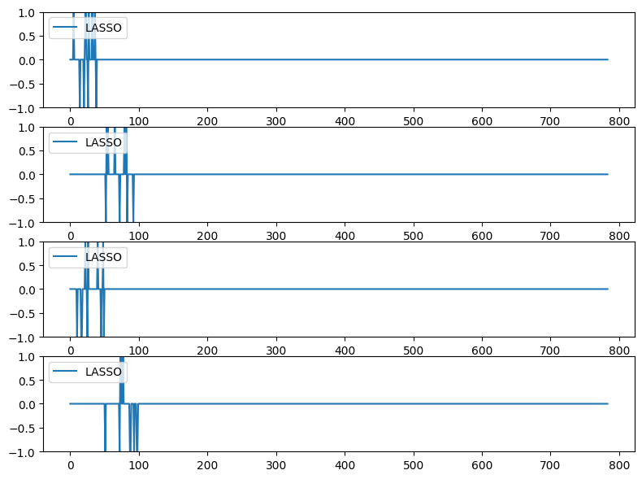
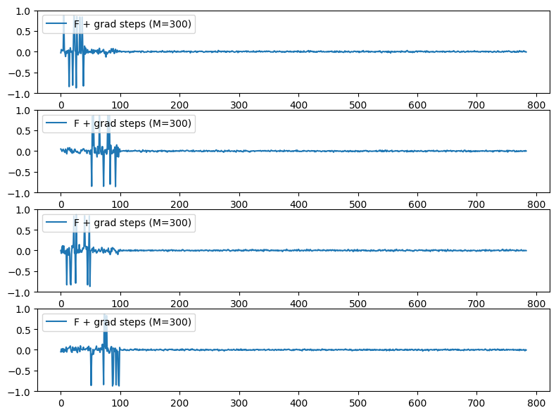
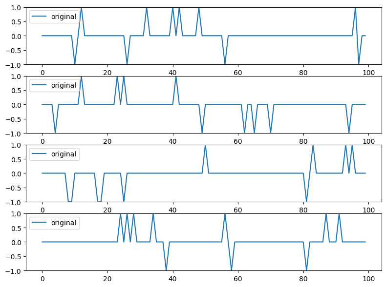
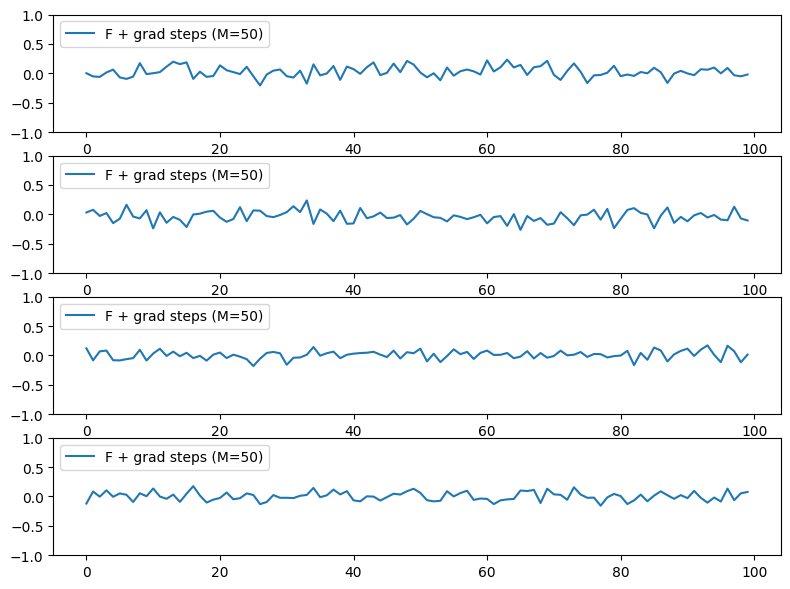
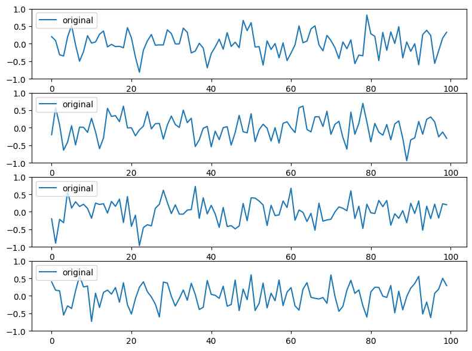
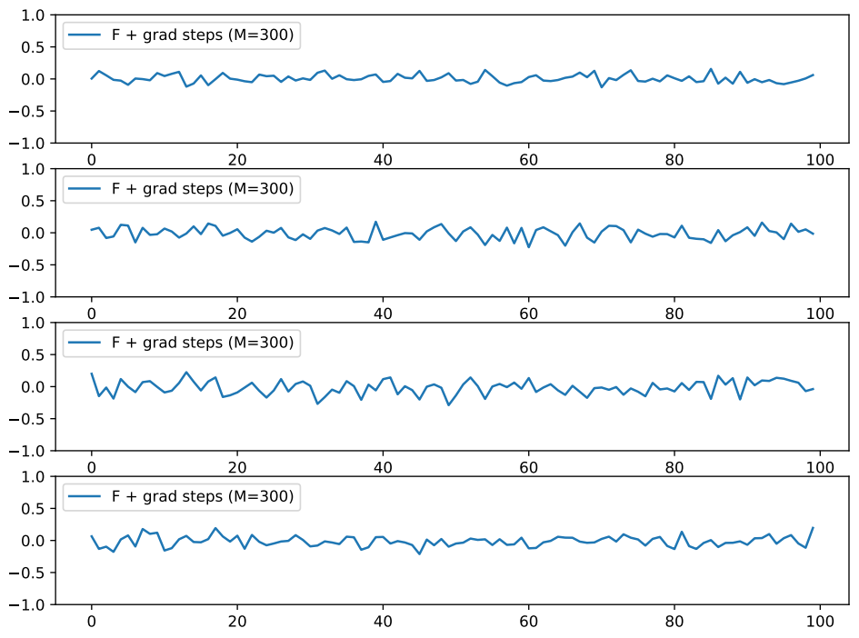
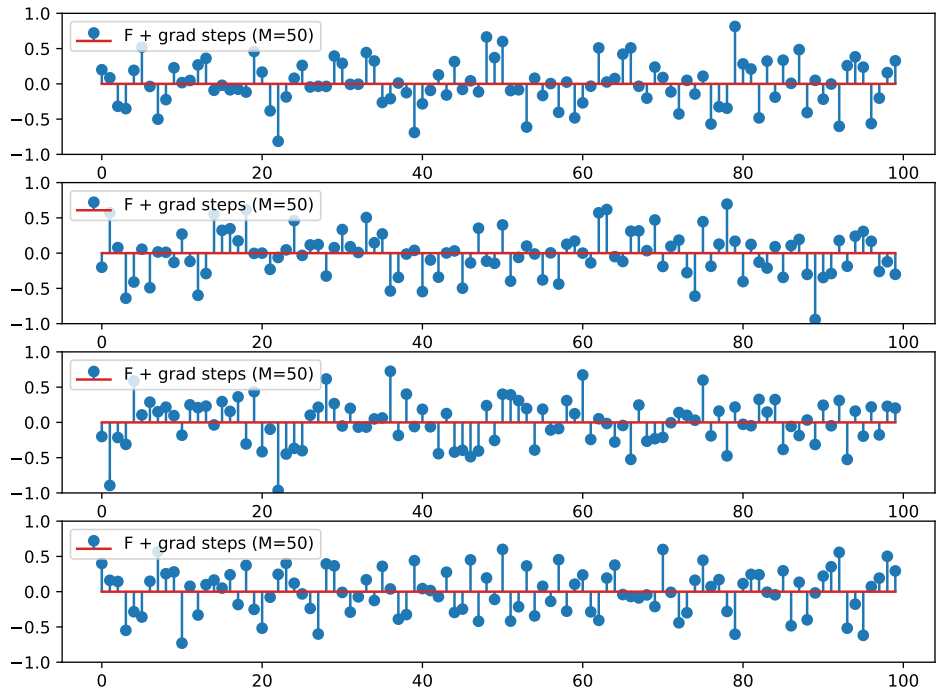
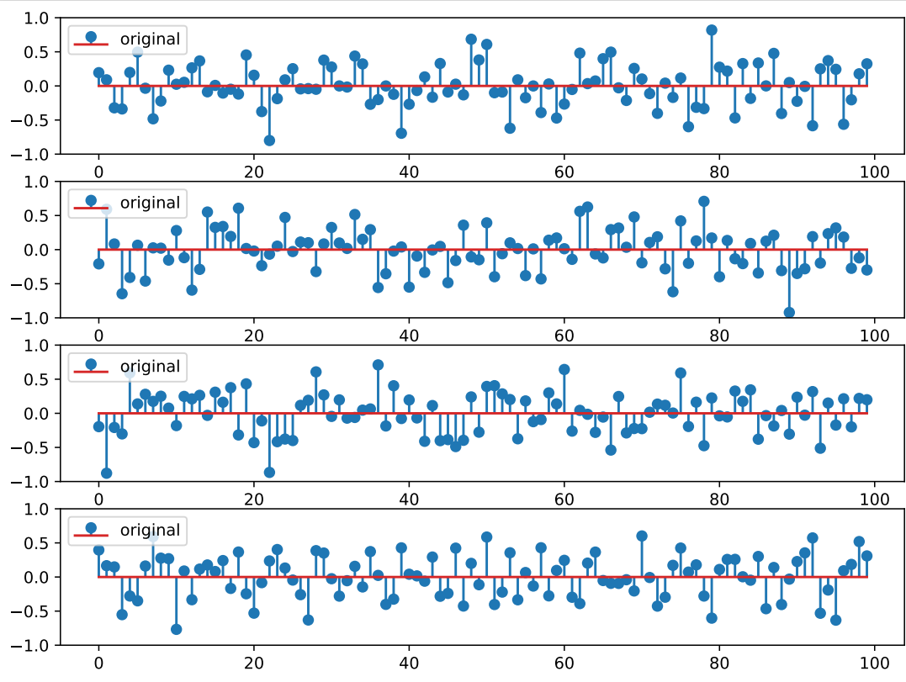
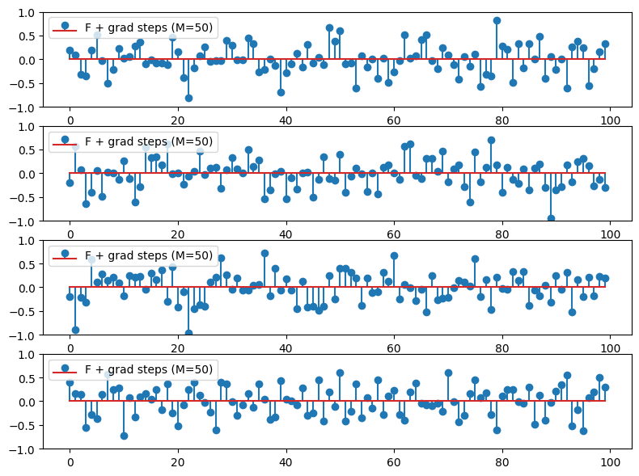

# Compressive Sensing using Generative Models
 
 [1] Wu, Yan, Mihaela Rosca, and Timothy Lillicrap. "Deep compressed sensing." International Conference on Machine Learning, 2019.
 
 First case, linear measurment process: $\textbf{y} = \\textbf{F} \\textbf{x}$, where the true signal $\\textbf{x} \in \mathbb{R}^n$, $\textbf{F} \in \mathbb{R}^{m \times n}$, and $\textbf{y} \in \mathbb{R}^m $, $m \ll n$.

## Recovery Error $\lVert x-\hat{x}\rVert_2$ for MNIST

A pretrained model $G_\theta$: $G$ is a neural network with parameter $\theta$.

- Ours: 4.78
- DCS: 3.4

Ours: Formula (7) is trained as a deep neural network.

## Recovery on the MNIST dataset

 $\textbf{F}_\phi$: $\textbf{F}$ is reparameterized as a deep neural network with parameter $\phi$.

|Method|LOSS|Origin image| 1 steps|3 steps | 5 steps|
|-------| ----|------- | -----|------ |-----|
|$\textbf{F}_\phi$ (L) + grad|4.78|||||
|$\textbf{F}_\phi$ (L) + NN|10.20|||||
|Fix $\textbf{F}$ + grad steps          (m = 100) |6.97|||||
|Fix $\textbf{F}$ + grad steps          (m = 300)|4.50|||||

|${\overline{X}}$|$\overline{G_\theta (z_0)}$|
|---------|----------------------|
|||

## Reconstruction on the synthetic sparse signal (Formula (7) is trained as a deep neural network)
- Number of iterations = 20
- Latent space dimension = 100
- N = 784, sparsity = $\frac{10}{784}$
- $B^{784}$ with $B = (-1,0, 1)$
### DCS
|Method|Number of iterations|Origin|Recovery|
|---|----|----|----|
|LASSO|10|||
|$G_\theta(z)$|10|||

### DCT
|Method|$\Phi$|$X_{Origin}$|$X_{generated}$|
|---|----|----|----|
|$G_\theta(z)$|Identity|||
|$G_\theta(z)$|DCT|||

### Gen
|Method|$X_{Origin}$|$X_{generated}$|
|---|----|----|
|$Loss = MSE(G_\theta(z), \Phi z)$|||
|$Loss = MSE(G_\theta(z_{random}), \Phi z)$|||

### Lasso vs DCS

