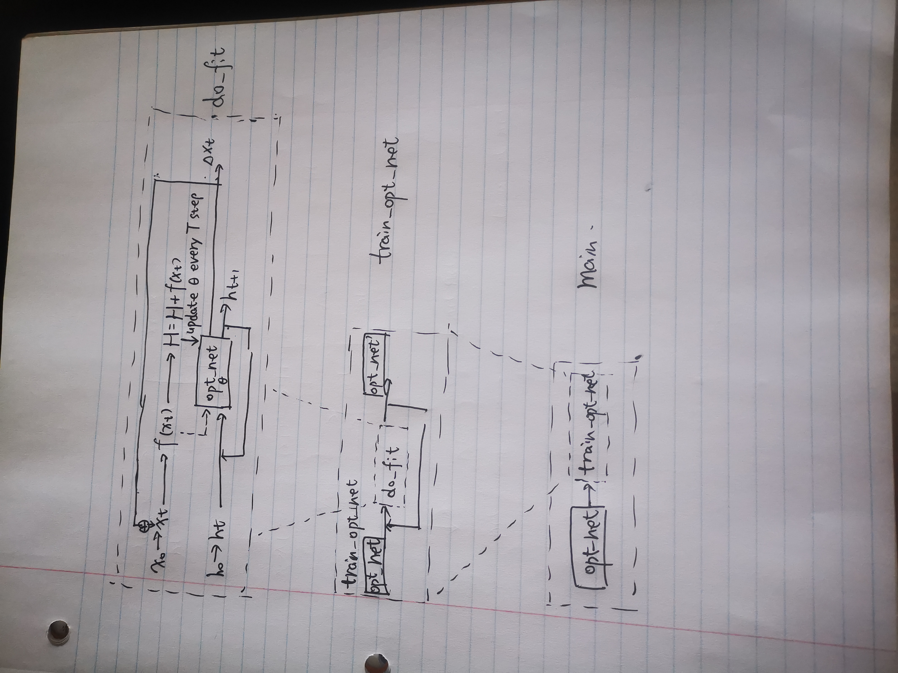

# Learn to Optimize: Graph Maxcut
## File structure
```python
main.py #inlcuding the following functions: main, train_opt_net, roll_out
opt_gurobi.py # gurobi code to compute optimal solutions, gurobi license is required
utils.py # utils file, including opt_net, opt_variable, obj_fun and other utility functions
```
## Run our method with the following command 

```
python main.py #N #Sparsity
```

## Run gurobi with the following command 

```
python opt_gurobi.py #N #Sparsity
```


## Experiment Results
Sprsity=0.5
|Maxcut |Gurobi|Ours|
|-------|------|----|
|N=20   | 67   | 67 |
|N=30   | 132   | 132 |
|N=100   | 1408   | 1409 |
|N=1000   |  128508  |  129900|
## Workflow
 