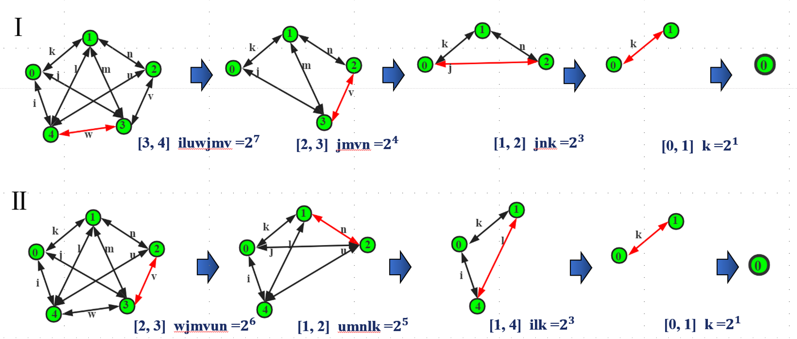

# Classical Simulation of Quantum Circuits
Roadmap
- [x] Formulation of classical simulation of quantum circuits
- [ ] Massively parallel simulation environment for classical simulation
- [ ] Baseline methods: greedy, BRB
- [ ] Dataset
- [ ] RL achieves optimality and outperforms baselines on single GPU

